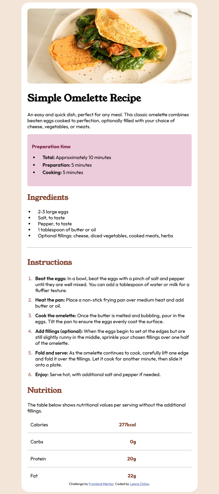

# Recipe_Page
This is my first small project about **Recipe Page** that is challenged by [Frontend Mentor](https://www.frontendmentor.io). This project do not have responsive as it is my first one, I will try to make a reposive one in the future.

## Demo
Visit Here: <a href="https://leangchhay1523.github.io/Project1_Recipe_Page/" target="_blank">Link</a> 

## Technology Used
- HTML
- CSS
  
## Acknowledgements
Thanks to [Frontend Mentor](https://www.frontendmentor.io) for providing the challenge and starter files that helped me build this project.

## Contact
Reach out to me for feedback : 
- Email: [kimleangchhay.song.321@gmail.com](mailto:kimleangchhay.song.321@gmail.com)
- GitHub: [Leangchhay1523](https://github.com/Leangchhay1523)
